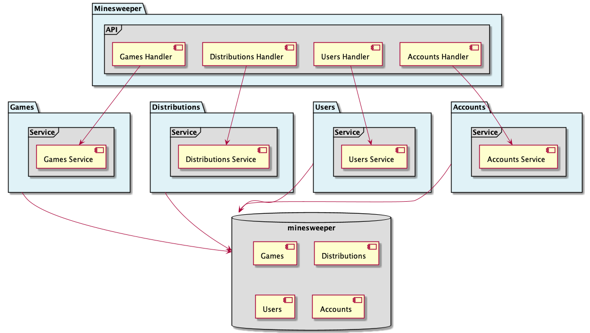

# API Minesweeper - Architecture
The main objective of this application is give enpoints to minesweeper game operations:

- Game: Creation and update minesweeper instances.
- Distributions: Creation and update mines distributions to each game.
- Users: Creation and getting users data.
- Accounts: Creation and getting Accounts data.

 

[Back home](/README.md)
