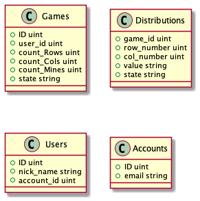

# Minesweeper-API - Database
## MySQL Database Configuration

The productive DB is `minesweeper`.

## Understanding Tables

There are 4 tables in this database:
- Games: this table store data about minesweeper instances.
- Distributions: this table store data about mines grid distributions of each game started.
- Users: this table store data about users.
- Accounts: this table store data accounts.

  

 

[Back home](/README.md)
